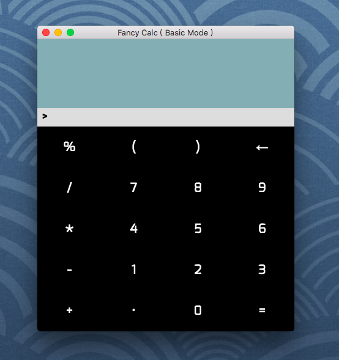
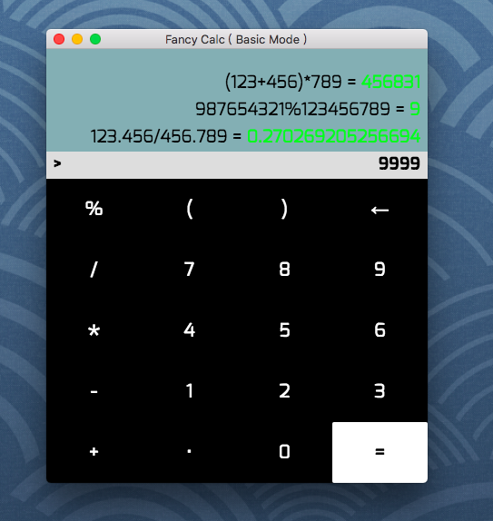
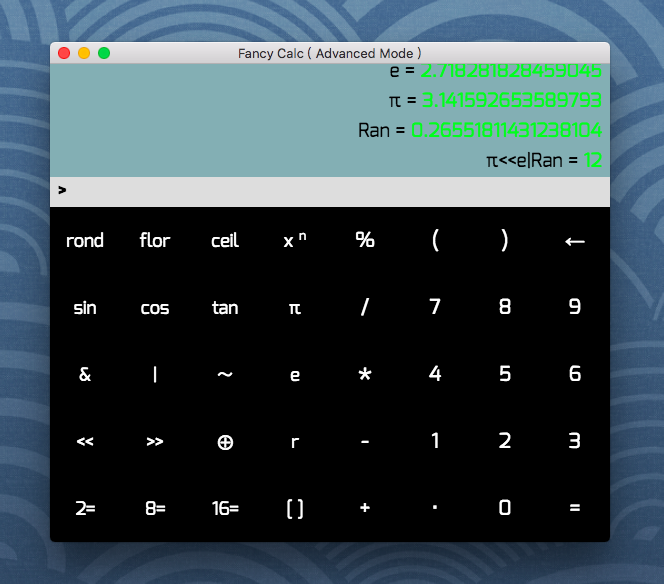
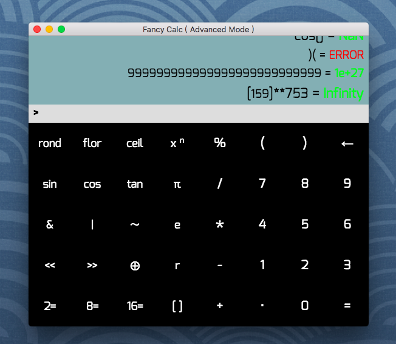
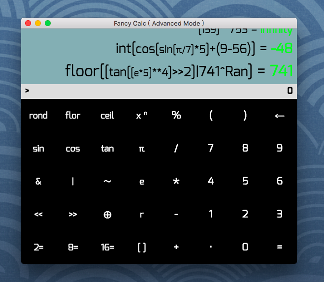
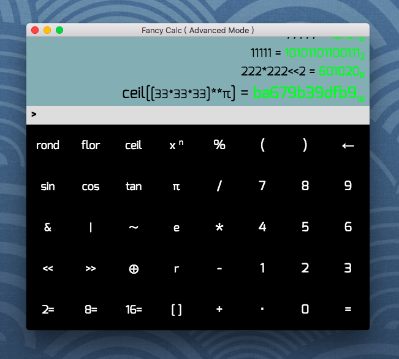
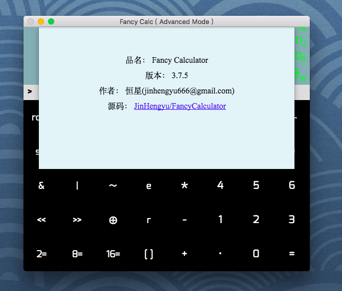
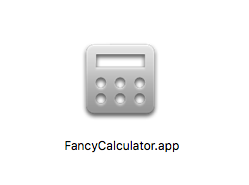

#  Fancy Calculator
基于 Electron + ES6 实现的桌面计算器应用。

<!-- 相关文章：[Electron 实战桌面计算器应用]() -->

## 介绍
看完《node.js设计模式》头脑一热就开发了一部electron应用, 这已经是第三次做app项目了;
当时觉得吧, mac自带的计算器太鸡肋, 就自己开发了一个更高级的...;
我这里通过 Electron 实现了一个很精致的计算器.具体演示看截图;
没有用到任何的第三方库,甚至mathjs.js都没用;

### 真-Fancy

## 特性
尽可能的实现了海量功能和精致的UI:

- 基本的四则运算外加模运算 (废话)
- 基本的次方与开根操作
- 基础键盘和高级模式自由切换
- 历史记录保存显示, 非常直观
- 通过方向键实现管道功能: 上一次的运算结果变成下一次的表达式
- 模拟数字小键盘: 通过JKLUIO等按键模拟数字键, 外加特效
- 允许局部删除, 即撤销操作
- 提供了丰富的常见数学函数
- 通过字符大小实现括号的层次嵌套效果, 使得表达式更可读
- 提供了强大的逻辑运算符, 可自由组合复杂的逻辑表达式
- 提供了进制转换功能, 一目了然
- 提供了若干常数如PI(圆周率),E(自然对数底),Ran(随机数)等
- 页面实现各种鼠标互动和淡入淡出效果
- 采用google的robot字体和各种特殊符号
- 完善的帮助文档和各种快捷键和菜单辅助

## 效果图










## 环境
开发环境: vscode

- maxOS v10.13.4+
- Electron v2.0.2

## 运行
```
git clone https://github.com/JinHengyu/FancyCalculator.git
cd ./FancyCalculator/
npm start 或 electron .
```

## 打包 ( mac )
```
npm install 或 cnpm install
npm run package
```
则会在项目中生成个 ./output/FancyCalculator-darwin-x64/ 目录，打开里面的 FancyCalculator.app 即可运行APP。
